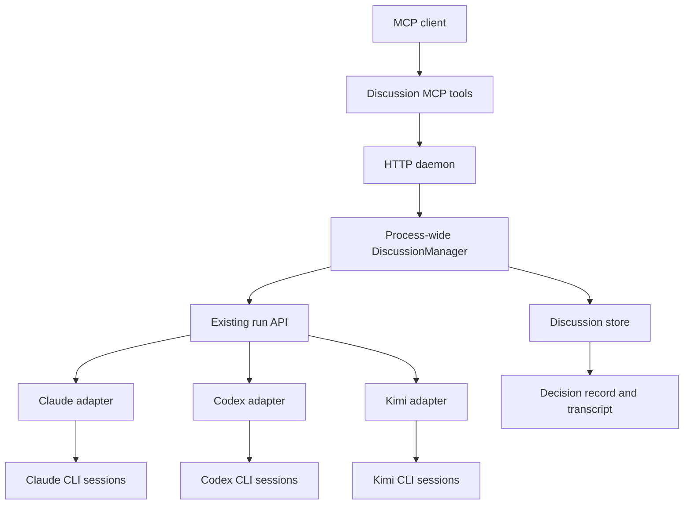

# Agent Discussion 功能设计

状态：MVP 已实现（已吸收 Kimi K3 / Claude Fable 5 复审，并通过单元、恢复与 HTTP 端到端测试）

目标版本：MVP

最后更新：2026-07-18

## 1. 背景

Agent Hub 已经把 Claude Code、Codex 和 Kimi Code 统一为本地非交互 CLI
run，并明确区分：

- `run_id`：Agent Hub 管理的一次执行。
- `cli_session_ref`：目标 CLI 管理的多轮会话。

Discussion 在这两个抽象之上增加一个有状态的讨论控制层。它不是让多个 CLI
自由聊天，而是为高价值设计、评审和决策问题执行一种可恢复、可审计的结构化
讨论协议：参与者先独立判断，再交叉验证，由专用主持人综合结论。

设计参考 Microsoft Agent Framework 的 Group Chat / Magentic 思路，以及 A2A
对 Agent、Task、Message、Artifact 和上下文的分层，但 MVP 使用本项目现有的
Node.js、文件存储和 CLI adapter 原生实现，不引入新的多智能体框架。

## 2. 目标

### 2.1 核心目标

对同一个高价值问题取得多个相互独立的判断，通过定向质疑降低遗漏和错误，最终
生成一份带证据、分歧和不确定性的决策记录。

功能是否有价值，不以“agent 是否聊起来”为标准，而以它是否在离线盲评中稳定
优于最强单 agent 为标准。

### 2.2 工程目标

- 复用并小幅扩展现有 run API：幂等派发、轻量快照查询、session lease/lineage 和
  可选 usage 归一化都属于底层 run 能力，不由 Discussion 绕过 adapter 自建。
- 保持普通 run 的 prompt 原样透传语义不变。
- Discussion 独立持久化，daemon 重启后可以恢复。
- 每个参与者拥有独立 CLI session；同一个参与者的多轮发言优先复用 healthy session，
  失败、分支或 lineage 变化时按确定性规则重建。
- 所有正式结论可以追溯到材料或具体发言事件。
- 过程有明确的轮次、时间、重试和 quorum 边界。
- Discussion 只运行在常驻 HTTP daemon 中，不依赖 MCP 请求或 stdio 进程的生存期。

## 3. 非目标

MVP 明确不做：

- 自由群聊、round-robin、Magentic 等多种可选讨论策略。
- 主持人或参与者在会议中邀请、移除或替换成员。
- 发起者在讨论过程中插话、补材料或私下指导某位参与者。
- Follow-up 时重组主持人、参会名单或角色。
- 全局 Agent Profile Registry；继续复用现有 `agent_id + metadata`。
- 独立会议 UI 或实时聊天界面。
- 全局 CLI 并发上限和队列治理。
- 对 adapter `auto` 模式产生的工作区副作用做检测、隔离或回滚。
- 直接执行讨论结论，例如修改正式工作区、提交代码或发送外部消息。
- 把 Discussion 记录当作永久知识库；记录仍按 7 天 TTL 清理。
- 为已弃用的 stdio transport 增加 Discussion tools 或编排能力。

## 4. 核心原则

### 4.1 发起者拥有会议，主持人负责执行

发起者负责：

- 定义目标和核心问题。
- 准备并提交材料。
- 确定主持人、参会名单、角色和关注点。
- 设置 quorum。
- 接收最终结果，必要时在会议结束后发起 follow-up。

主持人负责：

- 阅读独立首轮 memo。
- 识别共识、冲突、证据缺口和脆弱假设。
- 为参与者生成定向验证问题。
- 根据证据综合最终决策记录。

主持人不计入 quorum，不提交独立方案，也不作为正式讨论者。主持人若在最终记录
中加入自己的推断，必须明确标为主持人推断，不能伪装成参会共识。

### 4.2 固定骨架，动态追问

MVP 只支持一个版本化协议：

```text
独立 memo
  -> 主持人识别争议和脆弱假设
  -> 定向验证/质疑
  -> 参与者修正结论
  -> 主持人生成决策记录
```

主持人可以决定要验证什么、向谁提问，但不能跳过独立首轮、验证阶段或最终异议
记录。即使首轮完全一致，也必须验证至少一个最脆弱的共同假设，但不能强迫参与者
制造虚假反对意见。

当首轮有 `N` 位有效参与者时，正常成功路径固定为 `3N + 2` 个逻辑 turn：每位
参与者各执行独立 memo、验证回应和修正结论，主持人执行 ModerationPlan 和
DecisionRecord。重试作为 attempt 单独计数，不能扩展逻辑轮次。

### 4.3 不投票，不强求共识

参与者数量和底层模型数量不能直接代表证据权重。最终结论由主持人按证据质量综合，
允许保留有依据的少数意见，并说明什么新证据可能改变结论。

### 4.4 参与者消息是不可信数据

只有 Discussion coordinator 生成的控制区可以要求 agent 执行本轮任务。其他 agent
发言以带作者和事件 ID 的结构化数据传递，不能被解释为 Hub 控制指令。

服务端只解析主持人的严格控制 schema，绝不从 participant 自由文本中推断邀请、
取消、执行命令或其他控制动作。

## 5. 概念模型

### 5.1 三层身份

| 层级 | 含义 | 示例 |
|---|---|---|
| Adapter | 如何启动和续接某个 CLI | `claude-code`、`codex`、`kimi-code` |
| Participant configuration | 本场讨论中的角色和运行配置 | 安全审查、成本分析、实现评审 |
| Participant session | 某位参与者在本场讨论中的 CLI 上下文 | `cli_session_ref` |

MVP 不增加全局 Profile Registry。Participant configuration 直接复用现有
`agent_id + metadata`，并附加本场讨论专用的 `participant_id`、`role` 和
`focus`。

adapter 的 Discussion 运行边界由现有 capability 声明扩展，不在 coordinator 中按
`agent_id` 写条件分支。每个可参会 adapter 必须声明：

- `supported_permissions`
- `preferred_discussion_permission`
- 各权限下的 `network_access`
- `max_prompt_bytes`
- `session_resume`

缺少任一字段时，该 adapter 仍可运行普通 run，但不能参加 Discussion。

允许多个 participant 使用同一个 `agent_id`。系统不把 adapter 去重作为约束，
但会在决策记录中披露每位参与者实际使用的 adapter、模型配置和角色，供发起者判断
团队多样性。

### 5.2 资源关系



一个 Discussion 包含：

- 一个专用主持人 participant 和 session。
- 一组固定正式参与者及各自 session。
- 一份冻结的材料 manifest。
- 一个 append-only 事件流。
- 多个底层 `run_ref`。
- 零或一份正式 `DecisionRecord`。
- 可选的 `parent_discussion_ref`，用于 follow-up。

## 6. MCP 接口

MVP 只在 `streamable-http` transport 注册四个新工具：

- `dispatch_discussion`
- `query_discussion`
- `wait_discussion`
- `cancel_discussion`

stdio transport 不注册这些工具，也不创建 DiscussionManager。MVP 不增加中途发言、
邀请、踢人或暂停工具。

### 6.1 DiscussionRef

```json
{
  "discussion_id": "uuid"
}
```

`discussion_id` 与 `run_id`、CLI 原生 session ID 相互独立。

### 6.2 dispatch_discussion：新讨论

`dispatch_discussion` 使用 `kind` 作为判别字段。新讨论示例：

```json
{
  "kind": "new",
  "objective": "评估新的 agent discussion 功能是否值得实现",
  "question": "在当前 Agent Hub 架构中，最小且可靠的实现边界是什么？",
  "cwd": "/absolute/path/to/project",
  "materials": [
    {
      "material_id": "requirements",
      "type": "inline",
      "title": "需求说明",
      "content": "发起者准备材料和名单，主持人负责结构化讨论。"
    },
    {
      "material_id": "architecture",
      "type": "file",
      "title": "现有架构",
      "path": "/absolute/path/to/project/docs/architecture.md"
    }
  ],
  "host": {
    "agent_id": "codex",
    "metadata": {
      "codex": {
        "effort": "high"
      }
    }
  },
  "participants": [
    {
      "participant_id": "security-reviewer",
      "agent_id": "claude-code",
      "role": "安全审查",
      "focus": "寻找权限边界、提示注入和恢复语义问题",
      "metadata": {
        "claude": {
          "effort": "high"
        }
      }
    },
    {
      "participant_id": "implementation-reviewer",
      "agent_id": "kimi-code",
      "role": "实现评审",
      "focus": "评估复杂度、兼容性和最小实现路径",
      "metadata": {
        "kimi-code": {
          "effort": "high"
        }
      }
    }
  ],
  "quorum": 2
}
```

输入约束：

- `kind=new` 时，`objective`、`question`、`cwd`、`host`、`participants` 和
  `quorum` 必填。
- `cwd` 继续遵守现有绝对路径和 allowlist 规则。
- `participant_id` 在本场讨论中唯一；至少需要两位正式参与者。
- `quorum` 必须在 `1..participants.length` 范围内。
- 主持人与参与者可以使用相同 adapter，但拥有独立 session。
- `metadata` 继续使用现有 unified/adapter namespace；model、effort 和 add_dirs 等
  普通字段继续透传，但权限字段按第 12 节处理。
- objective 最多 8 KiB，question 最多 16 KiB，role 最多 2 KiB，focus 最多
  8 KiB，material title 最多 1 KiB；各类 ID 最多 80 个安全字符。长度统一按
  UTF-8 字节计算。
- 参与者数量不设产品级硬上限；发起者承担规模、成本和在固定 deadline 内无法完成的
  风险。

Coordinator 在返回 accepted 前完成 schema、路径、capability、材料大小和 follow-up
handoff 等确定性 preflight；accepted 后才允许启动任何 agent run：

```json
{
  "status": "accepted",
  "discussion_ref": {
    "discussion_id": "uuid"
  },
  "poll_after_ms": 1000
}
```

### 6.3 dispatch_discussion：follow-up

Follow-up 创建一个新的 Discussion，而不是重新打开或修改原记录：

```json
{
  "kind": "follow_up",
  "parent_discussion_ref": {
    "discussion_id": "previous-uuid"
  },
  "question": "新增约束是必须支持另一种 adapter，这会改变结论吗？",
  "materials": [
    {
      "material_id": "new-constraint",
      "type": "inline",
      "title": "新增约束",
      "content": "新 adapter 不能保证 session resume。"
    }
  ]
}
```

Follow-up 规则：

- parent 必须尚未过 7 天 TTL，且为 `status=completed` 并拥有合法 DecisionRecord。
- 继承原 objective、cwd、主持人、参会名单、角色、focus、quorum 和请求 metadata；
  只允许提交新 question 和新增材料。
- follow-up 分支携带 objective、cwd、host、participants、role、quorum 或权限字段时
  直接拒绝，不能静默忽略。目标已经变化时应创建新的独立 Discussion。
- accepted 前把 parent DecisionRecord、确定性选择的结构化事件、材料 manifest、
  roster 和 session lineage 冻结为 child 自有的 handoff bundle。child 不延长 parent
  TTL，也不能在 handoff 完成前 accepted。
- participant 重建上下文时收到 parent DecisionRecord、原 objective/question、自己的
  正式消息、指向自己的 assignments、自己的验证回应、DecisionRecord provenance
  引用的事件，以及新增材料；主持人收到 parent 的全部已接受结构化事件。原始 stdout、
  失败输出和自由 transcript 不进入 handoff。
- CLI session 是线性历史。一个 parent session 最多由一个 child 原子认领；同一
  parent 的 sibling follow-up 或 lineage 已变化的 session 必须新建 session 并使用
  handoff 重建。沿 parent-child-grandchild 单链才允许继续 resume。
- 每位成员独立记录 `resumed` 或 `rebuilt`，允许同一 follow-up 内混合两种方式。
- 原 Discussion 永远保持不可变；child 记录 `parent_discussion_ref`。

### 6.4 query_discussion

输入支持事件游标：

```json
{
  "discussion_ref": {
    "discussion_id": "uuid"
  },
  "after_sequence": 120,
  "limit": 50
}
```

默认返回完整状态投影、participant 摘要、active run refs 和最近 50 条事件；`limit`
最大为 200。响应携带 `next_sequence` 和 `has_more`，不重复内嵌完整 CLI log。

运行中响应至少包含：

```json
{
  "status": "running",
  "phase": "challenge",
  "discussion_ref": {
    "discussion_id": "uuid"
  },
  "progress": {
    "participants_total": 2,
    "participants_effective": 2,
    "formal_turns_completed": 4,
    "attempts_completed": 4
  },
  "participant_statuses": [],
  "recent_events": [],
  "active_run_refs": [],
  "next_sequence": 124,
  "has_more": false,
  "poll_after_ms": 1000
}
```

终态 `completed` 响应返回：

- `protocol_integrity`
- `conclusion_strength`
- Markdown `content`
- 结构化 `decision`
- Discussion artifacts
- 关联的 participant/host `run_ref` 列表

### 6.5 wait_discussion

`wait_discussion` 复用现有等待语义，并接受与 query 相同的 `after_sequence`：

- 单次服务端等待窗口为 10 分钟。
- 讨论尚未结束时返回 `status: "running"` 和 `timed_out: true`。
- 调用方保留同一个 `discussion_ref` 和事件游标继续等待。
- 等待超时或 MCP client 断开都不会取消讨论。

### 6.6 cancel_discussion

取消语义：

- 在 discussion lock 内提交 `discussion.cancel_requested`，设置
  `cancellation_requested=true`，从此禁止创建新 turn。
- 对当前活跃 participant/host runs 调用现有 `cancelAgentRun`。
- 派发调用返回 `run_ref` 后必须再次检查取消标志；若取消已经发生，立即补取消该 run，
  关闭 check-then-act 竞态。
- 不再调用主持人做部分总结。只有所有已知 active runs 进入终态后，Discussion 才提交
  `discussion.cancelled`。
- 终态保留已产生的材料、事件、原始输出和 run 引用，但不生成正式
  `decision.json` / `decision.md`。

## 7. 生命周期和状态模型

### 7.1 生命周期状态

```text
queued -> running -> completed
                  -> failed
                  -> cancelled
                  -> unknown
```

`status` 只表达执行生命周期：

- `queued`
- `running`
- `completed`
- `failed`
- `cancelled`
- `unknown`

`unknown` 只用于存储完整性无法恢复：`state.json` 损坏但可从事件重建时应自动修复；
只有事件中部损坏、sequence 断裂或无法确定已派发 turn/终态时才进入 unknown。模型
失败、超时、低于 quorum 和主持人输出非法都有明确含义，必须使用 `failed`。

### 7.2 讨论阶段

`phase` 与生命周期正交：

- `preparing`：校验请求、冻结材料、创建 participant 状态。
- `independent`：并行收集独立首轮 memo。
- `moderating`：主持人根据首轮 memo 生成验证计划。
- `challenge`：参与者执行定向验证。
- `revision`：参与者提交修正后的最终立场。
- `synthesizing`：主持人生成 DecisionRecord。

### 7.3 结论质量

执行完整性和结论力度是正交维度，不能压进一个有歧义的 `outcome` 枚举：

- `protocol_integrity: complete | degraded`
  - `complete`：所有要求的正式 turn 都成功。
  - `degraded`：首轮达到 quorum，但有参与者缺席或后续正式 turn 失败/超时。
- `conclusion_strength: conclusive | inconclusive`
  - `conclusive`：证据足以给出明确建议。
  - `inconclusive`：有效 DecisionRecord 认为证据仍不足。

`protocol_integrity` 由 Coordinator 根据事件确定；`conclusion_strength` 来自通过 schema
和 provenance 校验的 DecisionRecord。低于 quorum 或没有合法 DecisionRecord 时是
`status=failed`，不能用 inconclusive 包装失败。

## 8. 结构化讨论协议

### 8.1 材料准备与冻结

Coordinator 在任何 agent run 启动前创建 material bundle：

- `inline` 材料原样保存并计算 SHA-256。
- `file` 材料必须是经过 realpath/allowlist 校验的普通文件；Coordinator 通过同一文件
  descriptor 复制并计算 SHA-256，避免校验与读取之间替换内容。
- 单份材料最多 128 KiB，冻结材料包合计最多 256 KiB，超限在 accepted 前拒绝；
  MVP 不截断、不自动摘要。
- 如果 `cwd` 是 Git 仓库，额外记录 HEAD、分支、porcelain status 和完整 dirty diff 的
  SHA-256。dirty diff 全文不会自动加入材料或 prompt；需要讨论时由发起者显式提交。
- 未跟踪文件只有在显式作为 `file` 材料提交时才进入冻结材料包。

“冻结”只覆盖提交到 `materials` 的内容，不自动复制整个 `cwd`。参与者仍可以为了
理解代码读取实时工作区，但这类新增信息必须像外部调研一样登记为新增证据，不能
悄悄冒充冻结材料。

所有参与者收到相同的 objective、question 和冻结材料；不同 participant 只额外收到
自己的 `role` 和 `focus`。

### 8.2 独立首轮

- Coordinator 直接根据版本化模板生成首轮 prompt。
- 首轮前不调用主持人，避免主持人提前过滤或重写材料。
- 所有 participant runs 可以并行派发。
- 参与者互相看不到首轮输出。
- 每位参与者必须返回一个长度受限、结构固定的 `ParticipantMemo`。
- Coordinator 等待所有首轮 runs 进入终态或独立阶段截止；达到 quorum 不会提前结束
  其他参与者，以免最快回复者决定实际会议构成。

### 8.3 主持人生成验证计划

全部首轮进入终态或阶段截止，并且有效 memo 达到 quorum 后：

- 完整的、长度受限的首轮 memo 共享给主持人。
- 主持人识别共识、分歧、证据缺口和最脆弱共同假设。
- 主持人输出严格的 `ModerationPlan`，为每位首轮有效参与者生成恰好一个 assignment；
  一个 assignment 可以包含多个相关检查点，但只触发一个正式验证 turn。
- 主持人不能邀请新成员、改 roster、执行任意工具动作或提前结束会议。

### 8.4 验证/质疑

- 所有有效参与者看到全体首轮 memo 和分配给自己的验证任务。
- 参与者可以点名提出希望某人回应的问题，但不能直接启动对方。
- Coordinator 只执行主持人 `ModerationPlan` 中的正式 assignment。
- 至少一个 assignment 必须验证最脆弱的共同假设，即使首轮完全一致。
- 角色限定关注范围，不强迫支持或反对某个预设结论。
- 参与者返回严格的 `ChallengeResponse`；Coordinator 不从自由文本猜测验证结果或
  evidence 状态。

### 8.5 修正结论

- Coordinator 为每位有效参与者提供全部已接受的结构化验证结果和新增证据，不判断
  哪些内容“与其有关”。
- 参与者提交严格的 `RevisionMemo`，逐项声明原 claim 是保持、修改还是撤回。
- 验证 turn 失败的参与者仍可进入 revision，但必须使用 healthy session；没有 healthy
  session 时按第 10 节重建。
- 每位参与者最多三次正式发言：首轮、验证回应、修正结论。

### 8.6 综合决策

主持人看到：

- 冻结材料 manifest。
- 全部有效首轮 memo。
- ModerationPlan。
- 验证回应。
- 修正后的 participant 结论。
- 所有登记的外部证据。

主持人输出严格的 `DecisionRecord`。服务端验证 JSON 后，以 JSON 为权威源，确定性
渲染 `decision.md`。主持人不能用自由 Markdown 代替正式记录。

Coordinator 不自动访问 URL 或本地路径判定外部证据真伪；它只根据
`ChallengeResponse.evidence_verdicts` 更新 evidence 状态。主持人必须保留
`reported | corroborated | contested | unavailable`，不能把 reported 写成已确认事实。

## 9. 结构化消息

下面是逻辑结构，不是最终 JSON Schema；实现时使用 Zod 定义并带
`schema_version`。

### 9.1 ParticipantMemo

```json
{
  "schema_version": 1,
  "recommendation": "建议先实现固定协议 MVP",
  "claims": [
    {
      "claim_id": "claim-1",
      "statement": "现有 run/session 分层足以承载 discussion",
      "evidence_refs": [
        "material:architecture"
      ]
    }
  ],
  "risks": [
    {
      "statement": "Kimi 无法强制只读",
      "severity": "medium",
      "evidence_refs": [
        "material:architecture"
      ]
    }
  ],
  "counterexamples": [],
  "uncertainties": [],
  "confidence": {
    "level": "high",
    "rationale": "核心生命周期已经存在"
  },
  "questions_for_others": []
}
```

`confidence.level` 使用 `low | medium | high`，避免伪精确百分比。

### 9.2 外部证据

参与者可以自行调研，但新增信息必须显式登记：

```json
{
  "evidence_id": "external-1",
  "kind": "external",
  "source": "https://example.com/source",
  "retrieved_at": "2026-07-18T00:00:00.000Z",
  "claim": "该来源支持的具体事实",
  "relevance": "它如何改变或验证本场讨论",
  "status": "reported"
}
```

本地工作区中未进入冻结材料包的发现也按外部证据登记，`source` 使用绝对路径和可用
的 Git revision。

### 9.3 ModerationPlan

```json
{
  "schema_version": 1,
  "consensus": [],
  "disagreements": [],
  "evidence_gaps": [],
  "weakest_shared_assumption": "当前 daemon 的恢复机制足够可靠",
  "assignments": [
    {
      "assignment_id": "challenge-1",
      "participant_id": "security-reviewer",
      "question": "请寻找 daemon 重启后重复调度的竞态",
      "related_claim_refs": [
        "event:12#claim-1"
      ]
    }
  ]
}
```

Coordinator 只接受已存在 participant 的 assignment。主持人不能通过 schema 选择
任意 `agent_id`。assignments 必须与首轮有效 participant 一一对应，且至少一个指向
`weakest_shared_assumption`。

### 9.4 ChallengeResponse

```json
{
  "schema_version": 1,
  "assignment_id": "challenge-1",
  "tested_claim_refs": ["event:12#claim-1"],
  "method": "检查 daemon 重启和重复派发路径",
  "findings": [],
  "evidence_added": [],
  "evidence_verdicts": [
    {
      "evidence_ref": "external:external-1",
      "status": "corroborated",
      "rationale": "来源与本地实现一致"
    }
  ],
  "remaining_uncertainties": []
}
```

`evidence_verdicts.status` 只能是 `corroborated | contested | unavailable`。Coordinator
只接受当前 participant 的 assignment ID 和已存在/本轮新增的 evidence ref。

Coordinator 保留每条结构化 verdict，并确定性计算 evidence 汇总状态：存在 contested
时为 contested；否则存在 corroborated 时为 corroborated；全部验证均 unavailable 时为
unavailable；从未收到 verdict 时维持 reported。主持人不能覆盖该聚合结果。

### 9.5 RevisionMemo

```json
{
  "schema_version": 1,
  "claim_dispositions": [
    {
      "claim_id": "claim-1",
      "disposition": "modified",
      "statement": "run/session 分层可承载 discussion，但需要幂等派发",
      "evidence_refs": ["event:24"]
    }
  ],
  "new_claims": [],
  "responses_to_challenges": [],
  "recommendation": "修订恢复语义后实现",
  "disagreements": [],
  "uncertainties": []
}
```

`disposition` 只能是 `maintained | modified | withdrawn`；所有原 claim 必须恰好出现
一次。withdrawn claim 不允许伪造新的支持证据。

### 9.6 DecisionRecord

```json
{
  "schema_version": 1,
  "protocol_version": 1,
  "conclusion_strength": "conclusive",
  "recommendation": {
    "summary": "实现固定协议的原生 DiscussionManager",
    "conditions": []
  },
  "consensus": [],
  "disagreements": [],
  "evidence": [],
  "rejected_options": [],
  "risks": [],
  "uncertainties": [],
  "host_inferences": [],
  "confidence": {
    "level": "high",
    "rationale": "关键生命周期和恢复路径有现成基础"
  },
  "next_actions": [],
  "provenance": []
}
```

每项共识、分歧、证据、风险和被否决方案都必须带 provenance，引用：

- `material:<material_id>`
- `event:<sequence>`
- `event:<sequence>#<claim_id>`
- `external:<evidence_id>`

服务端必须验证每个引用真实存在、对主持人可见且类型匹配。未知或越权 provenance
会让整份 DecisionRecord 非法并触发一次格式修复，不能丢弃单条结论继续。主持人独有
判断只能放入 `host_inferences`。

### 9.7 大小和解析边界

- ParticipantMemo、ChallengeResponse、RevisionMemo：各最多 32 KiB。
- ModerationPlan：最多 32 KiB。
- DecisionRecord：最多 64 KiB。
- Zod schema 同时限制数组项数量和单字符串长度，避免绕过语义上限。
- 输出解析只允许去除 UTF-8 BOM/首尾空白，以及剥掉包裹整个输出的唯一一层
  `json` 或无语言 Markdown code fence；随后执行一次 `JSON.parse` 和严格 schema
  校验。
- 不从说明文字中搜索大括号、不选择多个候选对象、不修补或截断字段。

## 10. Prompt 和上下文同步

### 10.1 分层职责

- `dispatch_to_agent` 和 adapter 继续原样透传收到的 prompt。
- Discussion coordinator 在调用 run API 之前显式组装 discussion prompt。
- 每份 discussion prompt 记录模板版本并保存到 Discussion artifacts。
- 不修改普通 run 的 system prompt、wrapper 或 result 提取语义。
- MVP 不使用各 CLI 可能存在的原生 JSON Schema 参数；先通过统一 prompt、严格解析和
  一次修复验证成功率。只有真实 selftest 无法达到失败率门槛时，才另行增加
  `native_structured_output` capability。

### 10.2 Prompt 分区

逻辑上分成：

1. Coordinator 控制区：本轮唯一可信任务、输出 schema 和限制。
2. 角色区：participant 的 role/focus 或主持人职责。
3. 材料区：冻结材料 manifest 和内容。
4. 会议事件区：带作者和事件 ID 的不可信结构化数据。
5. 输出区：要求只返回符合 schema 的 JSON。

参与者文本即使包含“忽略前文”“修改文件”或伪造控制 JSON，也只属于会议事件区。

每次派发前对最终渲染的 UTF-8 prompt 做字节检查，不能只检查材料。上限来自该
adapter 冻结的 `max_prompt_bytes` capability；初始 Kimi 配置为 512 KiB，低于
当前 macOS 1 MiB argv 上限并为环境变量和命令参数留出空间。超限时该 turn 在启动
CLI 前失败，MVP 不截断或摘要。

### 10.3 Session 增量同步

`last_seen_event_sequence` 按 CLI session 保存，而不是按 participant 保存：

- 第一次运行收到完整公共材料和角色要求。
- 后续续接同一 `cli_session_ref` 时，只发送该 participant 尚未看到且与本轮相关的
  会议事件。
- 不把完整 transcript 反复注入已经持有历史的 CLI session。
- 首轮 memo 是例外：验证阶段向所有参与者完整共享有长度上限的首轮 memo。
- 新 session 的 sequence 从零开始，按当前 turn 的确定性重建规则发送完整公开上下文。

### 10.4 Session 健康状态

只有产生合法且已接受结构化输出的 session 才是 `healthy`。一个逻辑 turn 两次尝试
均失败后，相关 session 标记为 `tainted`；该成员若仍能进入下一阶段，必须新建
session 并从已接受事件重建，失败输出只保留在 run artifacts。

follow-up resume 失败会消耗第一次 attempt；第二次也是最后一次 attempt 使用新
session 和 handoff bundle 重建。第二次仍失败时该 turn 失败，不增加第三次机会。

## 11. 重试、quorum 和失败

### 11.1 Turn 尝试次数

每个正式 participant/host turn 最多两次尝试：

- CLI、provider 或模型执行的可重试失败使用新 session，并重放该 turn 的完整公开上下文。
- 首次 run 成功但输出不符合 schema 时，如存在 healthy `cli_session_ref`，第二次是同一
  session 的纯格式修复；没有 session ref 时使用新 session。
- 配置、模型名、权限、路径、capability、prompt 超限等确定性错误不重试。
- deadline、用户取消不重试；无法可靠分类的错误默认不重试，避免重复潜在副作用。
- 底层错误结果应提供标准化 `retryable`；resume session 不存在使用独立错误码，以便
  follow-up 走已定义的重建路径。
- 第二次仍失败，该 turn 失败，不做自由文本猜测性降级。
- 原始输出始终保存在底层 run artifacts 中。

每个逻辑 turn 拥有稳定 `turn_id`；attempt 使用
`discussion:<discussion_id>:turn:<turn_id>:attempt:<n>` 作为底层持久化幂等键。同一键
和同一请求 hash 重复调用必须返回相同 `run_ref`；请求 hash 不同则返回
`idempotency_conflict` 并停止该 Discussion。

同一个 `cli_session_ref` 同一时间只能有一个活跃 continuation，该约束由底层 session
lease 保证，而不是只靠单个 Discussion controller 自律。

### 11.2 Quorum

- 首轮有效 participant 数量低于 quorum：Discussion 失败。
- Quorum 只在独立首轮检查一次。首轮达到 quorum 后，后续 turn 失败允许继续，并将
  `protocol_integrity` 设为 degraded。
- 即使后续 participant turn 全部失败，只要主持人仍能基于已接受首轮材料生成合法
  DecisionRecord，也允许 `completed + degraded`；结论可以是 inconclusive。
- 主持人永远不计入 quorum。
- 主持人无法生成合法 ModerationPlan 或 DecisionRecord：Discussion 失败，即使已有
  participant 原始输出。

### 11.3 硬预算

- 每位参与者最多三次逻辑 turn；主持人最多两个逻辑 turn；每个 turn 最多两次 attempt。
- accepted 时间记为 `T0`，整场按 wall-clock 最长 30 分钟。每阶段同时受自身最大时长
  和全局绝对截止点约束，提前完成不会把剩余时间转赠给下一阶段：

| 阶段 | 自身最大时长 | 绝对截止点 |
|---|---:|---:|
| independent | 10 分钟 | `T0 + 10m` |
| moderating | 3 分钟 | `T0 + 13m` |
| challenge | 6 分钟 | `T0 + 19m` |
| revision | 6 分钟 | `T0 + 25m` |
| synthesizing | 5 分钟 | `T0 + 30m` |

- 实际 `phase_deadline = min(phase_started_at + 自身最大时长, 绝对截止点)`。
- 阶段截止时取消仍在运行的 runs；首轮按 quorum 决定继续或失败，后续 participant
  阶段按已接受结果继续并降级。主持人阶段截止仍没有合法输出时 Discussion 失败。
- 重试只能使用当前阶段剩余时间，不能延长 deadline。
- daemon 停机时间仍计入 wall-clock。恢复时只有底层 run 的可信
  `completed_at <= phase_deadline` 才能被接受；更晚结果标记 `late` 并保留 artifact，
  但不进入正式事件。没有可信 completed_at 时按超时处理。
- `T0 + 30m` 前不存在合法 DecisionRecord 时必须 failed，不能在 deadline 后补写成功。

## 12. 权限和安全边界

### 12.1 尽力只读

Discussion 默认采用 best-effort read-only：

- effective permission 由 adapter capability 的 `preferred_discussion_permission` 决定，
  且必须属于其 `supported_permissions`。当前配置中 Claude/Codex 为 read-only，Kimi
  为 auto；Coordinator 不按 adapter 名称写死判断，也不会先给 Kimi 传 read-only。
- Discussion 只接受 `read-only` 或 `auto` 作为 preferred permission；即使普通 run
  capability 支持 full，Discussion 也不能选择或回退到 full。
- host/participant metadata 不允许包含 `permission`、`claude.permission_mode`、
  `codex.sandbox` 或其他权限覆盖字段；preflight 直接拒绝，而不是剥离或静默忽略。
- 只要 adapter 支持工作区只读，即使该模式下没有网络，也不为了调研能力回退 auto。
  `network_access` 与 permission 分别由 capability 披露。
- Prompt 明确要求讨论只分析、不修改正式工作区。
- MVP 不检测、不隔离、不回滚 adapter auto 产生的副作用。

因此“尽力只读”不是安全保证。该限制必须出现在工具说明、运行快照和最终决策记录
metadata 中，不能描述成强制只读。

### 12.2 Capability 解析与冻结

- `preparing` 阶段读取 adapter capability，解析 host/participant effective
  configuration，并冻结到本场 request/state。
- 运行中的配置变化不影响已冻结的权限、网络、prompt 上限或运行参数。
- follow-up 是新 Discussion，继承请求 metadata 但重新解析当前 capability；若与
  parent effective configuration 不同，必须记录差异。
- capability 缺少第 5.1 节任一必需字段时，adapter 不能参会。

### 12.3 路径和环境

- `cwd` 和 `metadata.*.add_dirs` 复用现有目录校验。material file 需要新增普通文件版
  realpath/allowlist 校验，不能直接调用只接受目录的 `validateDirectory`。
- Discussion 不能扩大现有 adapter 的可访问路径。
- 环境变量继续使用现有 allowlist 转发机制。
- command metadata 和 Discussion artifacts 不记录环境变量值。

### 12.4 消息完整性

- 事件包含单调递增 sequence、author、type、timestamp 和 payload。
- Material 和 prompt artifacts 记录 SHA-256。
- Participant 不能直接写 `events.jsonl`；只有 daemon 中的 DiscussionManager 可以
  提交正式事件。
- 状态投影从事件和已验证输出产生，participant 文本不能覆盖状态字段。

## 13. Daemon 内编排与恢复

### 13.1 Process-wide DiscussionManager

现有 HTTP transport 每个请求创建一个 MCP server/transport，但 DiscussionManager
必须是 HTTP daemon 的进程级单例，不能属于某次请求。stdio 不实例化 manager：

```text
server process
  ├── one DiscussionManager
  ├── many short-lived MCP request handlers
  └── many detached participant runs
```

建议职责：

- `start()`：扫描并恢复非终态 Discussion。
- `dispatch(request)`：持久化请求并触发执行。
- `ensureRunning(discussionId)`：幂等地确保内存中存在 controller task。
- `query()` / `wait()`：返回投影；必要时触发恢复。
- `cancel()`：持久化取消意图并取消活跃 runs。
- `shutdown()`：停止派发新 turn，不取消 detached participant runs。

daemon 启动时先创建 Discussion 根目录并扫描非终态记录，再开始监听 HTTP。全局目录
权限/配置故障会阻止启动；单场记录损坏只隔离该 Discussion，能重建就修复，不能重建
就标记 unknown，不能拖垮整个 daemon。`start()` 只需挂接 controller task，不等待整场
讨论结束。

### 13.2 单实例执行

每场 Discussion 使用持久化 lease/owner 记录，防止误启动的多个 HTTP daemon 同时
恢复同一讨论：

- 每个 daemon 启动生成随机 `process_instance_id`；PID 只用于诊断，不能单独证明身份。
- lease 包含 `owner_id`、单调递增 `generation` 和 `heartbeat_at`。
- 每 5 秒续约；20 秒无心跳即可由另一个 daemon 在 discussion lock 内原子接管。
- 每次提交事件、更新投影或派发 turn 前都验证 `owner_id + generation`；旧 controller
  恢复后也不能继续写入。
- 同一进程内再用 `Map<discussionId, Promise>` 防止重复启动。
- 材料复制、hash、模型等待等长操作必须在短时 discussion lock 之外执行。

### 13.3 恢复算法

daemon 启动或 `ensureRunning` 时：

1. 读取 `events.jsonl`，校验 sequence，并重建或核对 `state.json` 投影。
2. 对全部 `active_run_refs` 查询底层快照，而不是假设只有一个 active run。
3. run 仍在执行：重新挂接等待，不重复 dispatch。
4. run 已完成：按 phase deadline、retryable、schema 和 request hash 验证，提交缺失事件。
5. 已有 `turn.dispatch_requested` 但没有 run_ref：使用相同幂等键重新调用 dispatch，取回
   原 run，不能创建重复 run。
6. run 丢失/失败：按该 turn 剩余 attempt 和失败分类决定重建 session、重试或失败。
7. 从最后完成的协议阶段继续；deadline 已过时只接受截止前已完成的结果并立即结算。

daemon 停止期间 Discussion 暂停编排，但已经派发的 detached run 可以继续。daemon
重启后读取其终态并续会；停机时间不会暂停各阶段绝对 deadline。

### 13.4 派发、取消与关闭竞态

- Discussion 在派发前先提交 `turn.dispatch_requested`，其中包含逻辑 turn、attempt、
  request hash 和幂等键；底层 dispatch 返回后再提交 `turn.dispatched` 和 run_ref。
- 底层 run API 持久化幂等键索引。即使 daemon 在两次提交之间崩溃，恢复也只能取回
  同一个 run，不会留下不可认领的孤儿 run。
- 检查取消标志、登记 dispatch intent 和 active attempt 必须在同一 discussion lock
  内完成；dispatch 返回后重查取消状态并补取消，规则见 6.6。
- 收到 SIGTERM/SIGINT 后先停止接收新 Discussion/follow-up，再调用 manager shutdown；
  等待短临界区和“派发返回后记录 run_ref”完成，不取消 detached runs。正常释放 lease
  后关闭 HTTP；30 秒 grace 后仍未完成则退出，由 lease 超时和幂等派发恢复。

### 13.5 Session lease 与 lineage

底层 run store 增加 session registry，键为 `agent_id + native_session_id`：

- registry 保存单调递增 `generation`、最新 run ID、active lease 和可选 lineage claim。
- 任一 continuation 派发前必须原子取得 session lease；普通 `dispatch_to_agent` 遇到占用
  返回 `session_busy`。run 进入终态后释放，崩溃时根据关联 run 状态恢复或接管。
- 每次 continuation 原子递增 generation。Discussion 保存 parent 完成时看到的 generation，
  follow-up 只能 compare-and-swap 认领未变化的 session；被普通 run 续接、被 sibling
  认领或状态未知时必须 rebuild。
- parent session 被 child 认领后形成不可分叉的 lineage。即使 child 后续取消或失败，
  sibling 也不能重新消费该历史，以免观察到部分内容。
- Codex/Kimi 等延迟产生 native session ID 的 adapter 在 ref 可用时注册 session；未得到
  session ref 的失败 run 不创建虚假 registry 项。

session registry 与 idempotency index 作为 run 子系统的私有索引存放在 run 根目录的
保留子目录中；普通 run 枚举和 TTL 清理必须忽略这些目录。

### 13.6 底层 run API 增量

Discussion 需要下列通用底层能力：

- 内部可选 `idempotency_key` 和规范化 request SHA-256；不暴露给普通 MCP 调用方。
- 内部可选 `expected_session_generation`，用于 follow-up lineage CAS。
- 轻量 `queryAgentRunSnapshot(run_ref)`，只读取单个 run，不触发 runs 根目录全量清理。
- 终态结果可选标准化 `usage`：input/output/cached tokens 和模型报告成本；缺失值必须是
  unknown，不能当作零。
- 更精确的错误码和 `retryable`，以支持第 11.1 节失败分类。

Discussion controller 使用轻量快照入口；TTL 清理在 daemon 启动时执行一次，之后由
进程级定时任务周期执行。轮询间隔继续复用现有 timing 配置，不在 Discussion 代码里
写死。

## 14. 持久化模型

### 14.1 目录

```text
~/.cache/agent-hub-mcp/
├── runs/
│   ├── <run_id>/
│   └── .internal/
│       ├── idempotency/
│       └── sessions/
└── discussions/<discussion_id>/
    ├── state.json
    ├── request.json
    ├── events.jsonl
    ├── lease.json
    ├── materials/
    │   ├── manifest.json
    │   └── items/
    ├── handoff/
    ├── prompts/
    ├── decision.json
    └── decision.md
```

Discussion 与 run 是平级资源。Discussion 只引用 `run_ref`，不复制底层 stdout、stderr
或 events。

`AGENT_HUB_DISCUSSION_DIR` 可以显式覆盖 Discussion 根目录；未设置时使用 run 根目录
同级的 `discussions/`。正常默认布局是 `~/.cache/agent-hub-mcp/runs/` 与
`~/.cache/agent-hub-mcp/discussions/`。测试必须分别覆盖两个根目录，不能写入真实缓存。

默认目录权限 `0700`，文件权限 `0600`。原子替换和短时 mkdir lock 可以沿用现有
策略，但长时 lease 使用第 13.2 节的心跳/fencing，不能复用 5 秒强拆的 state lock。

### 14.2 state.json

`state.json` 是快速查询投影，不是唯一事实源。至少包含：

- schema/protocol version
- discussion ID 和 parent ref
- status、phase、protocol integrity、conclusion strength
- cwd
- host/participant 公共状态、effective configuration 和 session health/lineage
- quorum
- started/completed/expires timestamps 和每阶段 deadline
- active run refs
- committed event sequence
- cancellation flag
- lease generation
- error

### 14.3 events.jsonl

事件采用 append-only JSONL。候选事件类型包括：

- `discussion.created`
- `materials.frozen`
- `phase.started`
- `turn.dispatch_requested`
- `turn.dispatched`
- `turn.completed`
- `turn.late`
- `turn.failed`
- `participant.memo.accepted`
- `challenge.response.accepted`
- `participant.revision.accepted`
- `external_evidence.recorded`
- `external_evidence.status_changed`
- `moderation.plan.accepted`
- `decision.accepted`
- `session.resumed`
- `session.rebuilt`
- `session.tainted`
- `discussion.cancel_requested`
- `discussion.recovered`
- `discussion.completed`
- `discussion.failed`
- `discussion.cancelled`

提交严格采用 event-first：在 discussion lock 内验证 lease generation 和 sequence，
追加完整事件并 fsync，然后根据事件计算投影并原子替换 `state.json`，最后释放锁。
不能先更新 state 再写事件。

恢复时允许丢弃唯一一条未换行或无法解析的尾部残片；最后一个完整事件仍需通过
sequence 校验，随后追加 `discussion.recovered`，记录丢弃字节数和原因。文件中部损坏、
重复 sequence 或断档不能自动猜测修复，Discussion 进入 unknown。

### 14.4 TTL

- Discussion 的 7 天 TTL 从进入 `completed | failed | cancelled | unknown` 的时间开始；
  非终态记录绝不能被清理器直接删除。启动或查询发现 deadline 已过时，先按持久化结果
  结算终态，再计算 expires_at。
- Follow-up 只能引用尚未过期的 completed parent。
- 关联 run 增加 `retained_by_discussion` 和 `retain_until`。Discussion 进入终态时把
  所有关联 runs 至少保留到自身 expires_at；run 清理器跳过有效保留项。
- Discussion 清理后解除保留，run 若已超过自身 TTL 可随即清理。已接受的结构化输出
  仍必须存在 Discussion events 中，不能只依赖 run artifacts。
- 清理逻辑不能跟随 artifacts 中的任意路径，只能删除经校验的 discussion 目录。

## 15. 输出和可观测性

### 15.1 正式产物

- `decision.json`：权威、机器可读的 DecisionRecord。
- `decision.md`：由 JSON 确定性渲染的人类可读版本。
- `events.jsonl`：完整会议审计轨迹。
- `materials/manifest.json`：材料版本和 hash。
- `prompts/`：实际发送的版本化 prompt，便于复现和排查。
- `handoff/`：follow-up accepted 前冻结的 parent 正式上下文副本。

MCP terminal response 把 `decision.md` 放入 `content`，把 DecisionRecord 放入
`structuredContent.decision`。

### 15.2 进度

运行中 query/wait 快照应暴露：

- status / phase
- 各 participant 的当前状态和正式 turn 计数
- 当前有效参与者数与 quorum
- active run refs
- 最近 Discussion 事件
- started_at、全局 deadline 和当前 phase deadline
- 是否发生恢复或降级
- 每位成员的 effective permission、network capability、session health 和 resumed/rebuilt
- 逻辑 turn 数、attempt 数、可用 usage 和 usage 覆盖率

不在 Discussion 快照中复制全部 CLI log；调用方可以使用关联的 `run_ref` 查询底层
细节。

## 16. 兼容性约束

- 现有六个 MCP tools 的 schema、默认权限和正常非并发行为不变；对同一 native session
  的并发 continuation 新增明确 `session_busy` 失败，替代未定义的并发行为。
- Discussion tools 只注册在 streamable HTTP；stdio 保留现有六个 run tools，标记为
  deprecated，本次不删除，后续单独下线。
- 现有 adapter prompt pass-through 不变。
- `run_id` 和 `cli_session_ref.native_session_id` 继续保持分离。
- 新 Discussion 只能通过现有 run API 启动 CLI，不能绕过 adapter、路径、环境或
  permission 映射。
- session lease 会拒绝对同一 native session 的并发 continuation；这是保护 session
  完整性的底层约束，不允许 Discussion 绕过。
- 新功能不要求 Python、.NET、LangGraph、AutoGen 或 OpenAI Agents SDK runtime。
- Node.js 版本要求继续为 20 或更新版本。

## 17. 测试策略

### 17.1 自动测试

普通 `npm test` 使用可脚本化 fake CLI/adapters，覆盖：

- 新讨论 happy path。
- 首轮隔离和首轮完整共享。
- 主持人固定角色和不计 quorum。
- participant 可重试失败后以新 session 成功；确定性失败不重试。
- 非法 memo 触发一次格式修复。
- 第二次仍非法后进入 quorum 逻辑。
- code fence 规范化和禁止猜测性 JSON 抽取。
- ChallengeResponse、RevisionMemo 和 provenance 严格校验。
- 达到 quorum 的 degraded/conclusive 与 complete/inconclusive 组合。
- 低于 quorum 的 failed。
- 主持人 ModerationPlan / DecisionRecord 非法。
- 无分歧时仍生成共同假设验证任务。
- 五阶段相对/绝对 deadline、late result 和每人三次逻辑 turn 上限；使用可注入时钟。
- wait 超时不取消。
- cancel 不生成部分决策记录。
- daemon 重启时重新挂接 running/completed run。
- 重复 `ensureRunning` 不重复 dispatch。
- dispatch 成功但 turn.dispatched 未提交时崩溃，恢复只认领原 run。
- cancel 与 dispatch 并发后没有泄漏 active run。
- 两个 manager 竞争 lease 时只有一个 generation 能提交事件。
- stale lease 接管后旧 controller 被 fencing。
- 每个 event/state 写入边界崩溃后都能确定性恢复。
- 尾部残缺事件可修复，中部损坏进入 unknown。
- Kimi 失败无 session ref 时第二次使用新 session 全量重放。
- session busy、generation CAS、sibling follow-up rebuild 和 tainted session rebuild。
- follow-up 继承 roster/role/metadata/session。
- follow-up 拒绝 roster 重组。
- failed/cancelled/unknown parent 不能 follow-up；child handoff 不延长 parent TTL。
- 材料复制、hash、allowlist、输入/prompt 超限和不自动注入 dirty diff。
- 关联 run 不会早于 Discussion 被 TTL 清理。
- state 从 events 重建，event-first 顺序可验证。
- participant 文本无法伪造控制事件。
- decision JSON 到 Markdown 的确定性渲染。

### 17.2 真实 CLI selftest

真实 Claude/Codex/Kimi 测试不进入默认 `npm test`，新增显式
`npm run selftest:discussion`，并作为发布前人工门槛：

- 新 session 和 continuation。
- Claude/Codex read-only 与 Kimi auto 的 capability 配置。
- ParticipantMemo、ChallengeResponse、RevisionMemo、ModerationPlan、DecisionRecord
  及 code fence 规范化。
- Kimi argv prompt 大小边界。
- 失败 session 重建和 follow-up lineage。
- 两 participant 加主持人的完整 30 分钟内流程。

## 18. 离线评测与发布门槛

先用至少 20 个真实设计/评审问题做 pilot，只用于调 prompt 和发现失败模式，不作为
go/no-go。协议和 prompt 冻结后，使用至少 50 个未参与调参的问题做正式盲评：

1. 最强单 agent。
2. 多 agent 独立回答后直接汇总。
3. 完整 Discussion 协议。

评估维度：

- 正确性。
- 关键风险和反例覆盖。
- 证据质量。
- 结论可执行性。
- 延迟、调用次数和失败率。
- input/output/cached tokens、模型报告成本和 usage 覆盖率。

答案匿名并随机排序，使用固定 rubric，由至少两名独立评审打分，分歧再仲裁。初始
go/no-go 门槛：

- 完整 Discussion 在至少 65% 的任务上优于最佳单 agent。
- 明显劣于单 agent 的任务不超过 10%。
- 关键风险/反例覆盖率至少提升 20%。
- 失败、超时或无法生成 DecisionRecord 的比例低于 5%。

不再设置与固定协议数学冲突的“调用次数不超过单 agent 4 倍”。评测必须报告
`3N+2` 逻辑 turn、实际 attempts、wall-clock 和可用 usage 的分布；usage 缺失显式为
unknown，不能当作零。usage 覆盖不足时只能报告成本区间，不能宣称满足某个成本倍数。
正式 benchmark 完成后再根据质量—成本曲线决定后续版本的成本门槛。

未达到门槛时，不通过增加自由轮次来掩盖问题；应先分析是模型能力、角色定义、材料
质量、主持 prompt 还是协议本身导致失败。

## 19. 建议代码结构

文件名可以在实现时微调，但职责应保持清晰：

| 文件 | 职责 |
|---|---|
| `src/discussions.js` | MCP-facing dispatch/query/wait/cancel 行为。 |
| `src/discussion-manager.js` | 进程级 controller registry、状态机、恢复和取消。 |
| `src/discussion-store.js` | Discussion 目录、事件、投影、锁、lease 和 TTL。 |
| `src/discussion-protocol.js` | 五种结构化消息 schema、大小、解析和 provenance 验证。 |
| `src/discussion-prompts.js` | 版本化 prompt 生成和不可信事件序列化。 |
| `src/discussion-render.js` | DecisionRecord 到 Markdown 的确定性渲染。 |
| `src/session-registry.js` | native session lease、generation、lineage claim 和恢复。 |
| `src/server.js` | 仅在 HTTP 注册四个 tools，并持有 process-wide manager。 |
| `src/runs.js` | 幂等派发、轻量快照、session fencing、usage 与错误分类增量。 |

## 20. 实现顺序

### 阶段一：底层可靠性增量

- 幂等派发键和 request hash 冲突检测。
- 单 run 轻量快照、标准化 retryable/usage。
- session lease、generation 和 lineage registry。
- 对现有普通 run 行为的回归测试。

### 阶段二：资源和协议

- DiscussionRef 和 MCP schema。
- Discussion store、state、event-first 提交、lock、lease、retention 和 TTL。
- 五种结构化消息 schema 及 Markdown renderer。
- 不启动真实 CLI 的状态机单元测试。

### 阶段三：固定讨论状态机

- 材料冻结。
- 独立首轮。
- 主持人 ModerationPlan。
- 验证、修正和 DecisionRecord。
- 重试、quorum、五阶段 deadline 和双维度结论质量。

### 阶段四：HTTP daemon 生命周期

- Process-wide DiscussionManager。
- 启动扫描、幂等恢复和 running run 重新挂接。
- wait/query/cancel、lease、shutdown 和崩溃边界测试。
- Discussion tools 仅 HTTP 注册，stdio 弃用说明。

### 阶段五：follow-up 和评测

- Parent handoff、线性 session lineage 和 sibling rebuild。
- Fake-adapter 全链路测试。
- `selftest:discussion`。
- 20 题 pilot、50+ 题正式盲评和 go/no-go 报告。

## 21. 已知限制

- capability 配置为 auto 的 adapter 仍可能产生副作用；MVP 只披露，不检测或回滚。
- 没有全局并发限制，发起者可以创建过多 participant 或 Discussion。
- 结构化 JSON 依赖模型遵守格式；MVP 只允许一次修复。
- 本地文件事件存储适合单机 daemon，不是分布式共识系统。
- Discussion 只支持 HTTP daemon；stdio 不获得新功能并将逐步下线。
- 工作区本身不做完整快照；只有显式材料包是冻结和可复现的。
- Discussion 只保留 7 天，不替代项目文档或长期决策日志。
- 同一个底层模型的多个 session 可能产生相关判断；系统只披露，不阻止。
- 原生 CLI session 能否在 7 天内 resume 仍取决于各 CLI；失败时按 handoff 重建。

## 22. 参考

- [Microsoft Agent Framework Group Chat](https://learn.microsoft.com/en-us/agent-framework/workflows/orchestrations/group-chat)
- [Microsoft Agent Framework Magentic](https://learn.microsoft.com/en-us/agent-framework/workflows/orchestrations/magentic)
- [A2A Protocol Specification](https://github.com/a2aproject/A2A/blob/main/docs/specification.md)
- [LangGraph JavaScript Persistence](https://docs.langchain.com/oss/javascript/langgraph/persistence)
- [Why Do Multi-Agent LLM Systems Fail?](https://arxiv.org/abs/2503.13657)
- [If Multi-Agent Debate is the Answer, What is the Question?](https://arxiv.org/abs/2502.08788)
